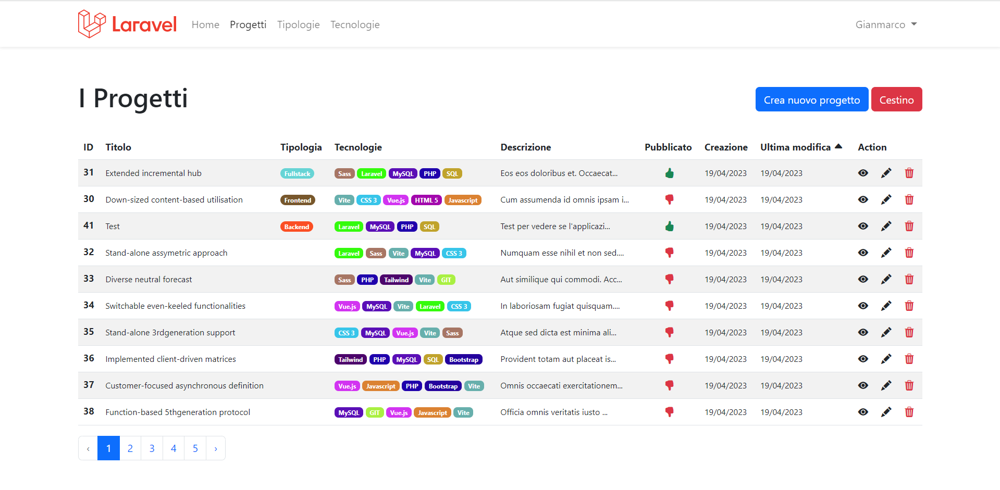
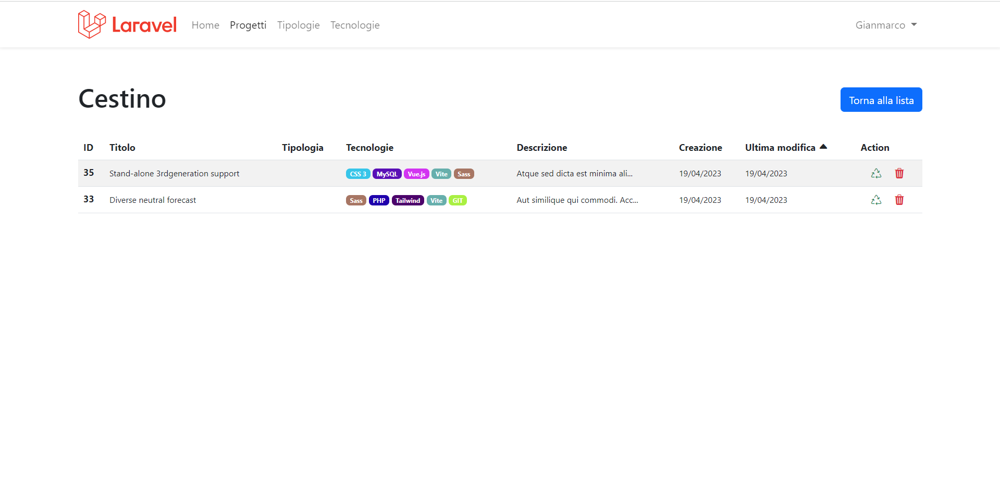
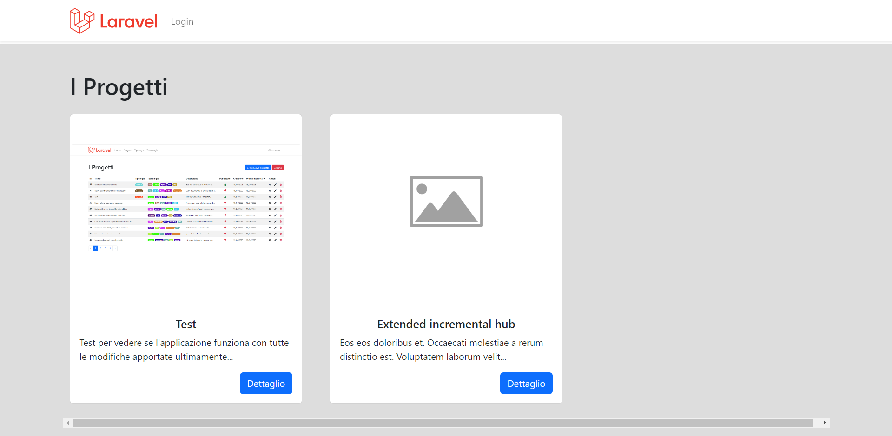

<div align="center"><a href="https://laravel.com" target="_blank"></a>
<h1><strong style="color: #EF3B2D;">9 + BOOTSTRAP TEMPLATE</strong></h1></div>

# Laravel Boolfolio

> Sistema di gestione del Portfolio dei miei progetti.



## Descrizione:

Realizzazione progetto usando laravel breeze ed il pacchetto Laravel 9 Preset con autenticazione.

## Svolgimento

### Admin

Iniziamo con il definire il layout, `Model`, `Migration`, `Controller` e `Route` necessarie per il sistema portfolio:

1.  _Autenticazione_: si parte con l'autenticazione e la creazione di un layout per back-office.
2.  Creazione del modello Project con relativa `migration`, `seeder`, `controller` e `routes`
3.  Per la parte di back-office creiamo un _resource controller_ Admin\ProjectController per gestire tutte le operazioni CRUD dei progetti.
4.  Possibilità di cliccare sul titolo della colonna nella tabella Backoffice per visualizzare risultati in oridine crescente.
    Al successivo click, l'ordine si invertirà, e quello visualizzato sarà quindi decrescente.
    Di default l'ordine di visualizzazione è da quello con la modifica più recente in poi.
5.  Possibilità di allegare le immagini ai progetti come dei veri e propri file tramite il `Restore`. Se non viene caricata nessuna immagine o se fallisce l'upload, ne verrà visualizzata una di placeholder
6.  Creazione di una checkbox per decidere se pubblicare o meno un progetto, se e solo se il check è 'on' questo sarà visibile sul lato guest.
7.  Aggiunta di una nuova entità `Type`, con rispettive `CRUD`, che è in relazione one to many con i progetti.
8.  Aggiunta di una nuova entità `Technology`, con rispettive `CRUD`, che è in relazione many to many con i progetti.
9.  Aggiunta della `softDelete()` per avere un cestino dove sprojectare i record alla prima eliminazione. Dal cestino è poi possibile reinserire gli elementi nel DB o eliminarli definitivamente
    

### Guest

1.  Visualizzazione progetti lato client.
    

# GUIDA RELAZIONI

## ONE TO MANY

### Migrations

Realizziamo una relazione fra l'entità type (una per project) e l'entità project (molti per type).

#### Prima migration (projects)

Possiamo creare il file di migrazione con il comando

```
php artisan make:migration create_projects_table
```

nel quale andremo poi a specificare i campi, gli indici ed i vincoli della tabella

```php
// xxxx_xx_xx_xxxxxx_create_projects_table

/**
 * Run the migrations.
 *
 * @return void
 */
public function up()
{
  Schema::create('projects', function (Blueprint $table) {
    $table->id();
    $table->string('title', 100);
    // altre colonne ...
    $table->timestamps();
  });
}
```

#### Seconda migration (types)

reeremo poi la migration per la tabella types

```
php artisan make:migration create_types_table
```

al cui interno aggiungeremo i campi

```php
// xxxx_xx_xx_xxxxxx_create_types_table

/**
 * Run the migrations.
 *
 * @return void
 */
public function up()
{
  Schema::create('types', function (Blueprint $table) {
    $table->id();
    $table->string('label', 20);
    // altre colonne ...
    $table->timestamps();
  });
}
```

#### Terza migration (FK & vincolo)

Infine abbiamo bisogno di realizzare il vincolo fra le due tabelle. Per farlo, nel nostro caso, abbiamo bisogno di una terza migration:

```
php artisan make:migration add_type_id_to_projects_table
```

Il nostro caso prevede che la relazione fra projects e types possa essere nulla, pertanto aggiungeremo i modificatori `->nullable()` e `->nullOnDelete()` (quest ultimo va sempre dopo `->constrained()`).

Nel caso la relazione non possa essere "null" basta omettere i modificatori.

```php
// xxxx_xx_xx_xxxxxx_add_type_id_to_projects_table

/**
 * Run the migrations.
 *
 * @return void
 */
public function up()
{
  Schema::table('projects', function (Blueprint $table) {
    $table->foreignId('type_id')
      ->after('id')
      ->nullable()
      ->constrained()
      ->nullOnDelete();
  });
}
```

nel metodo down prima dropperemo il vincolo e poi la colonna type_id

```php
// xxxx_xx_xx_xxxxxx_add_type_id_to_projects_table

/**
 * Reverse the migrations.
 *
 * @return void
 */
public function down()
{
  Schema::table('projects', function (Blueprint $table) {
    $table->dropForeign('projects_type_id_foreign');
    $table->dropColumn('type_id');
  });
}
```

### Models

Nei modelli aggiungiamo la relazione così che l'ORM possa mapparli correttamente.

#### Primo model (type)

Dal momento che è una relazione "uno a molti" l'entità "forte" `type` sarà relazionata a 0, 1 o più `project`.

Nel suo model andremo a scrivere:

```php
// App\Models\Type

class Type extends Model {

  // ...

  public function projects() {
    return $this->hasMany(Project::class);
  }
}
```

#### Secondo model (project)

L'entità `project` potrà essere relazionata a 0 o 1 entità `type`. Nel suo model scriveremo:

```php
// App\Models\Project

class Project extends Model {

  // ...

  public function type() {
    return $this->belongsTo(Type::class);
  }
}
```

Ora abbiamo accesso alla sintassi del tipo `$project->type` oppure `$type->projects`

### Seeders

Per prima cosa va lanciato il seeder per le type, così che esistano già nel momento della generazione dei projects. Proseguiamo a creare i file nello stesso ordine.

#### Primo seeder (types)

```
php artisan make:seeder TypeSeeder
```

In questo caso usiamo un array di type predefinite, ma possono essere generare anche con `Faker`.

```php
// Database\Seeders\TypeSeeder

/**
* Run the database seeds.
*
* @return void
*/
public function run(Faker $faker)
{
  $labels = ['Frontend', 'Backend', 'Fullstack'];

  foreach($labels as $label) {
    $type = new Type();
    $type->label = $label;
    // ...
    $type->save();
  }
}
```

Nel caso si usi Faker va sempre importato con:

```php
use Faker\Generator as Faker;
```

Possiamo quindi aggiungere il typeSeeder nel metodo `run` del file `DatabaseSeeder`

```php
// Database\Seeders\DatabaseSeeder

/**
 * Seed the application's database.
 *
 * @return void
 */
public function run()
{
  $this->call([
    TypeSeeder::class,
    // ...
  ]);
}
```

#### Secondo seeder (projects)

Nella generazione dei projects dovremo aggiungere l'id della tipologia associata. Per farlo useremo il metodo `->pluck('id')->toArray()` sulla collection delle type al fine di ottenere un array di id di tutte le type esistenti.

Dal momento che la type_id è nullable, con la condizione `(random_int(0, 1) === 1)` assegnamo null a (circa) metà dei projects, mentre l'altra metà avrà un type_id selezionato randomicamente.

```php
// Database\Seeders\ProjectSeeder
/**
 * Run the database seeds.
 *
 * @return void
 */
public function run(Faker $faker)
{
  $types = Type::all()->pluck('id')->toArray(); // [1, 2, ...]

  for($i = 0; $i < 40; $i++) {
      $type_id = (random_int(0, 1) === 1) ? $faker->randomElement($types) : null;

      $project = new Project;
      $project->type_id = $type_id;
      $project->title = $faker->catchPhrase();
      // ...
      $project->save();
  }
}
```

Possiamo quindi aggiungere il projectSeeder nel metodo `run` del file `DatabaseSeeder`

```php
// Database\Seeders\DatabaseSeeder

/**
 * Seed the application's database.
 *
 * @return void
 */
public function run()
{
  $this->call([
    TypeSeeder::class,
    ProjectSeeder::class,
    // ...
  ]);
}
```

### Controller + Views

Le CRUD per l'entità `type` possono essere realizzate seguendo la guida per le CRUD, pertanto ci concentreremo sulla parte relativa alla relazione, in particolare su `ProjectController` (in quanto l'entità `project` contiene la FK) e le relative views.

#### Lettura: index

Nel controller non c'è bisogno di apportare modifiche. E' opportuno però visualizzare il nome della categoria nella lista

```html
<!-- views/admin/projects/index.blade.php -->

<table class="table">
    <thead>
        <tr>
            ...
            <th scope="col">Tipologia</th>
            ...
        </tr>
    </thead>
    <tbody>
        @forelse($projects as $project)
        <tr>
            ...
            <td>{{ $project->type?->label }}</td>
            ...
        </tr>
        @empty
        <tr>
            <td colspan="n">Nessun risultato</td>
        </tr>
        @endforelse
    </tbody>
</table>
```

#### Lettura: show

Nel controller non c'è bisogno di apportare modifiche. E' opportuno però visualizzare il nome della categoria nel dettaglio

```html
<!-- views/admin/projects/show.blade.php -->

<strong>Tipologia: </strong>
@if($project->type) {{ $project->type->label }} @else Nessuna tipologia @endif
```

#### Creazione: create

Nel controller dobbiamo prendere tutte le possibili type da passare alla vista

```php
public function create()
{
  $project = new Project;
  $types = Type::orderBy('label')->get();
  return view('admin.projects.form', compact('project', 'types'));
}
```

e nel form dovremo stampare la select

```html
<!-- views/admin/projects/form.blade.php -->

<label for="type_id" class="form-label">
    Tipologia
</label>

<select name="type_id" id="type_id" class="@error('type_id') is-invalid @enderror form-select">
    <option value="">Non specificato</option>
    @foreach($types as $type)
        <option value="{{$type->id}}" @if(old('type_id', $project->type_id) == $type->id) selected @endif>{{$type->label}}</option>
    @endforeach
</select>
@error('type_id')
    <div class="invalid-feedback">
        {{$message}}
    </div>
@enderror
```

#### Creazione: store

Nel controller dovremo poi validare la richiesta controllando che l'id ricevuto esista nella tabella delle type

```php
// App\Http\Controllers\Admin\ProjectController
return Validator::make(
    $data,
    [
    // ...
    'type_id' => 'nullable|exists:types,id'
    ],
    [
    // ...
    'type_id.exists' => 'L\'ID della tipologia non è valido'
    ],
)->validate();
```

#### Modifica: edit

Sia nel controller che nel form valgono le modifiche specificate precedentemente nella sezione "create".

#### Modifica: update

Nessuna modifica necessaria in quanto la validazione è centralizzata.

#### Cancellazione: destroy

Nessuna modifica necessaria.

## MANY TO MANY

### Migrations

Realizziamo una relazione fra l'entità technology (molte per project) e l'entità project (molti per technology).

#### Prima migration (projects)

Possiamo creare il file di migrazione con il comando

```
php artisan make:migration create_projects_table
```

nel quale andremo poi a specificare i campi, gli indici della tabella

```php
// xxxx_xx_xx_xxxxxx_create_projects_table

/**
 * Run the migrations.
 *
 * @return void
 */
public function up()
{
  Schema::create('projects', function (Blueprint $table) {
    $table->id();
    $table->string('title', 100);
    // altre colonne ...
    $table->timestamps();
  });
}
```

#### Seconda migration (technologies)

creeremo poi la migration per la tabella technologies

```
php artisan make:migration create_technologies_table
```

al cui interno aggiungeremo i campi

```php
// xxxx_xx_xx_xxxxxx_create_technologies_table

/**
 * Run the migrations.
 *
 * @return void
 */
public function up()
{
  Schema::create('technologies', function (Blueprint $table) {
    $table->id();
    $table->string('label', 20);
    // altre colonne ...
    $table->timestamps();
  });
}
```

#### Terza migration (Tabella ponte, FKs & vincoli)

Infine abbiamo bisogno della tabella ponte o pivot tra le due entità, aggiungere le foreign keys e realizzare i vincoli fra le altre due tabelle. Per farlo abbiamo bisogno di una terza migration.

NB: _I nomi nelle tabelle nel file della migration devono essere al singolare ed in ordine alfabetico_.

```
php artisan make:migration create_project_technology_table
```

Nella tabella pivot le FKs non possono essere null, altrimenti il DB sarebbe incoerente e le relazioni si romperebbero. In questo caso usiamo la cancellazione "a cascata".

```php
// xxxx_xx_xx_xxxxxx_create_project_technology_table

/**
 * Run the migrations.
 *
 * @return void
 */
public function up()
{
  Schema::create('project_technology', function (Blueprint $table) {
    $table->id();

    $table->foreignId('project_id')
      ->constrained()
      ->cascadeOnDelete();

    $table->foreignId('technology_id')
      ->constrained()
      ->cascadeOnDelete();
  });
}
```

### Models

Nei modelli aggiungiamo la relazione così che l'ORM possa mapparli correttamente.

#### Primo model (technology)

Dal momento che è una relazione "molti a molti" non esiste entità "forte".
Iniziamo arbitrariamente dal modello `technology`.

```php
// App\Models\Technology

class Technology extends Model {

  // ...

  public function projects() {
    return $this->belongsToMany(Project::class);
  }
}
```

#### Secondo model (project)

Faremo lo stesso "al rovescio" per il modello project

```php
// App\Models\Project

class Project extends Model {

  // ...

  public function technologies() {
    return $this->belongsToMany(Technology::class);
  }
}
```

Ora abbiamo accesso alla sintassi del tipo `$project->technology` oppure `$technology->projects`

### Seeders

Partiamo arbitrariamente col seeder per le technologies.

#### Primo seeder (technologies)

Creazione del seeder

```
php artisan make:seeder TechnologySeeder
```

In questo caso usiamo un array di categorie predefinite, ma possono essere generare anche con `Faker`.
Non aggiungeremo le FKs (che sono sulla tabella ponte).

```php
// Database\Seeders\TechnologySeeder

/**
* Run the database seeds.
*
* @return void
*/
public function run(Faker $faker)
{
    $labels = [
                "GIT", "HTML 5", "CSS 3", "Bootstrap", "Tailwind", "Sass", "Javascript", "Vue.js", "Vite", "PHP", "SQL", "MySQL", "Laravel"
            ];

  foreach($labels as $label) {
    $technology = new Technology();
    $technology->label = $label;
    // ...
    $technology->save();
  }
}
```

Nel caso si usi Faker va sempre importato con:

```php
use Faker\Generator as Faker;
```

Possiamo quindi aggiungere il TechnologySeeder nel metodo `run` del file `DatabaseSeeder`

```php
// Database\Seeders\DatabaseSeeder

/**
 * Seed the application's database.
 *
 * @return void
 */
public function run()
{
  $this->call([
    TechnologySeeder::class,
    // ...
  ]);
}
```

#### Secondo seeder (projects)

Creiamo un seeder anche per i project

```
php artisan make:seeder ProjectSeeder
```

Non aggiungeremo le FKs (perchè sono sulla tabella ponte).

```php
// Database\Seeders\ProjectSeeder
/**
 * Run the database seeds.
 *
 * @return void
 */
public function run(Faker $faker)
{
  for($i = 0; $i < 40; $i++) {
      $project = new Project;
      $project->title = $faker->catchPhrase();
      // ...
      $project->save();
  }
}
```

Possiamo quindi aggiungere il ProjectSeeder nel metodo `run` del file `DatabaseSeeder`

```php
// Database\Seeders\DatabaseSeeder

/**
 * Seed the application's database.
 *
 * @return void
 */
public function run()
{
  $this->call([
    TechnologySeeder::class,
    ProjectSeeder::class,
    // ...
  ]);
}
```

#### Terzo seeder (tabella ponte project_technology)

Creiamo un seeder anche per la tabella ponte.

1. Prendiamo tutti i projects.
2. Prendiamo tutte le technologies come array di id.
3. Per ognuno dei project aggiungiamo da 0 a 3 technologies

```php
// Database\Seeders\ProjectTechnologySeeder

/**
 * Run the database seeds.
 *
 * @return void
 */
public function run(Faker $faker)
{
    $technologies = Technology::all()->pluck('id');

    for ($i = 1; $i <= 40; $i++) {
        $project = Project::find($i);
        $project->technologies()->attach($faker->randomElements($technologies, 5));
    }
}
```

Possiamo quindi aggiungere il ProjectTechnologySeeder nel metodo `run` del file `DatabaseSeeder`

```php
// Database\Seeders\DatabaseSeeder

/**
 * Seed the application's database.
 *
 * @return void
 */
public function run()
{
  $this->call([
    TechnologySeeder::class,
    ProjectSeeder::class,
    ProjectTechnologySeeder::class,
    // ...
  ]);
}
```

### Controller + Views

Le CRUD per entrambe le entità possono essere realizzate seguendo la guida per le CRUD. Dobbiamo decidere su quale entità gestire la relazione. Arbitrariamente (perché sembra più comodo) la gestiremo dal controller e dalle viste della risorsa `projects`.

#### Lettura: index

Nel controller non c'è bisogno di apportare modifiche. E' opportuno però visualizzare il nome della categoria nella lista

```html
<!-- views/admin/projects/index.blade.php -->

<table class="table">
    <thead>
        <tr>
            ...
            <th scope="col">Tecnologie</th>
            ...
        </tr>
    </thead>
    <tbody>
        @forelse($projects as $project)
        <tr>
            ...
            <td>
                @forelse($project->technologies as $technology)
                {{$technology->label }} @unless($loop->last) , @else .
                @endunless @empty - @endforelse
            </td>
            ...
        </tr>
        @empty
        <tr>
            <td colspan="n">Nessun risultato</td>
        </tr>
        @endforelse
    </tbody>
</table>
```

#### Lettura: show

Nel controller non c'è bisogno di apportare modifiche. E' opportuno però visualizzare le technologies associate nel dettaglio del project

```html
<!-- views/admin/projects/form.blade.php-->

<strong>Tecnologie:</strong> @forelse ($project->technologies as $technology)
{{$technology->label }} @unless($loop->last) , @else . @endunless @empty Nessuna
tecnologia associata. @endforelse
```

#### Creazione: create

Nel controller dobbiamo prendere tutte le possibili technologies da passare alla vista

```php
// App\Http\Controllers\Admin\ProjectController;

public function create()
{
  $project = new Project;
  $technologies = Technology::orderBy('label')->get();
  return view('admin.projects.form', compact('project', 'technologies'));
}
```

e nel form dovremo stampare i checkbox.

L'attributo `name="technologies[]"` con le quadre alla fine permette di inviare i valori di tutte le checkbox selezionate come array.

La riga `@if (in_array($technology->id, old('technologies', $project_technologies ?? []))) checked @endif` stampa l'attributo checked con le seguenti priorità:

1. valori precedentemente inviati dal form (caso validazione fallita, form inviato)
2. valori contenuti dall'istanza (caso modifica, form non inviato)
3. nessuno (caso creazione, form non inviato)

```html
<!-- views/admin/projects/form.blade.php-->

<label class="form-label">Tecnologie</label>

<div class="form-check @error('technologies') is-invalid @enderror p-0">
    @foreach ($technologies as $technology)
    <input
        type="checkbox"
        id="technology-{{ $technology->id }}"
        value="{{ $technology->id }}"
        name="technologies[]"
        class="form-check-control"
        @if
        (in_array($technology-
    />id, old('technologies', $project_technologies ?? []))) checked @endif >
    <label for="technology-{{ $technology->id }}">
        {{ $technology->label }}
    </label>
    <br />
    @endforeach
</div>

@error('technologies')
<div class="invalid-feedback">{{ $message }}</div>
@enderror
```

#### Creazione: store

Nel controller dovremo poi validare la richiesta controllando che gli id ricevuti esistano nella tabella technologies e fare l' `attach()` per inserirli nella tabella ponte.

```php
// App\Http\Controllers\Admin\ProjectController;

private function validation($data) {
    return Validator::make(
            $data,
            [
            // ...
             'technologies' => 'nullable|exists:technologies,id'
            ],
            [
            // ...
            'technologies.exists' => 'Le tecnologie selezionate non sono valide'
            ]
        )->validate();
}

// ...

$project = new Project;
$project->fill($data);
$project->save();

// ...

if(Arr::exists($data, "technologies")) $project->technologies()->attach($data["technologies"]);

```

#### Modifica: edit

Nel controller dobbiamo selezionare

1. tutti le technologies esistenti
2. tutti associati al project

ed inviarli alla view per la corretta visualizzazione delle checkbox

```php
// App\Http\Controllers\Admin\ProjectController;

/**
 * Show the form for editing the specified resource.
 *
 * @param  \App\Models\project  $project
 * @return \Illuminate\Http\Response
 */
public function edit(Project $project)
{
    $technologies = Technology::orderBy('label')->get();
    $project_technologies = $project->technologies->pluck('id')->toArray();
    return view('admin.projects.form', compact('project', 'technologies', 'project_technologies'));
}
```

Nel form valgono le modifiche specificate precedentemente nella sezione "create"

#### Modifica: update

Invece dell'attach va usato il `sync()` SE la chiave technologies è stata ricevuta. Altrimenti vuol dire che nessun technology è stato selezionato e facciamo il `detach()`

```php
// App\Http\Controllers\Admin\ProjectController;

/**
  * Update the specified resource in storage.
  *
  * @param  \Illuminate\Http\Request  $request
  * @param  \App\Models\project  $project
  * @return \Illuminate\Http\Response
  */
public function update(Request $request, Project $project)
{
    // ...

    $project->fill($data);
    // ...
    $project->save();

    if(Arr::exists($data, "technologies"))
    $project->technologies()->sync($data["technologies"]);
    else
    $project->technologies()->detach();
}
```

#### Cancellazione: destroy

Se è stato settato "on delete cascade" questo passaggio è opzionale.
Facciamo il `detach()` di tutte le relazioni prima dell'eliminazione del project

```php
// App\Http\Controllers\Admin\ProjectController;

/**
 * Remove the specified resource from storage.
 *
 * @param  \App\Models\project  $project
 * @return \Illuminate\Http\Response
 */
public function destroy(Project $project)
{
  $project->technologies()->detach();
  $project->delete();
}
```
